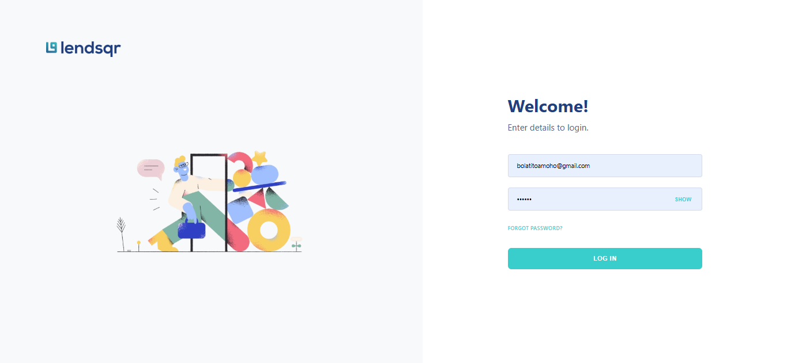
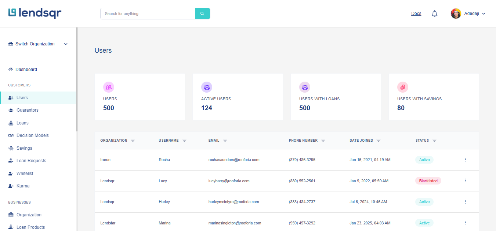
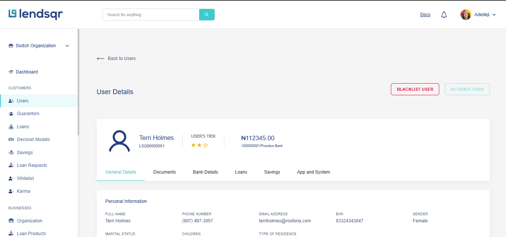

# Lendsqr Frontend Engineer Assessment

A modern, responsive user management dashboard built with React, TypeScript, and SCSS. This project demonstrates advanced filtering, pagination, data persistence, and responsive design principles.







##  Features

### Dashboard
- **Dynamic Statistics Cards**: Real-time metrics for total users, active users, users with loans, and users with savings
- **Responsive Grid Layout**: Fixed 240px card width on desktop, full-width on mobile
- **Auto-updating Stats**: Automatically recalculates when user data changes

### Users Table
- **Advanced Filtering**: Filter by organization, username, email, phone number, date joined, and status
- **Smart Pagination**: Configurable items per page (10, 20, 50, 100) with intelligent page number display
- **Status Management**: Activate or blacklist users directly from the table
- **Sorting & Search**: Quick access to user information
- **Action Menu**: View details, blacklist, or activate users with a single click
- **Responsive Design**: Card-based layout on mobile, table layout on desktop

### User Details Page
- **Comprehensive Profile View**: Personal information, education, employment, socials, and guarantor details
- **Tabbed Interface**: Organized sections for Documents, Bank Details, Loans, Savings, and App Settings
- **User Tier Display**: Star-based rating system
- **Bank Information**: Account balance and account number
- **Status Toggle**: Quick activate/blacklist functionality
- **Navigation**: Easy back button to return to users list

### Technical Features
- **LocalStorage Integration**: Data caching for improved performance
- **Real-time Updates**: Changes sync across components using custom events
- **Loading States**: User-friendly loading indicators
- **Error Handling**: Graceful fallbacks for missing data
- **Type Safety**: Full TypeScript implementation
- **Mobile First**: Responsive design with breakpoints at 480px, 768px, and 1024px

##  Tech Stack

- **React 18** - UI library
- **TypeScript** - Type safety and better DX
- **React Router DOM** - Client-side routing
- **SCSS** - Advanced styling with variables and mixins
- **Vite** - Fast build tool and dev server
- **LocalStorage API** - Data persistence

##  Installation

### Prerequisites
- Node.js (v16 or higher)
- npm or yarn

### Setup
```bash
# Clone the repository
git clone https://github.com/YOUR_USERNAME/lendsqr-fe-test.git

# Navigate to project directory
cd lendsqr-fe-test

# Install dependencies
npm install

# Start development server
npm run dev
```

The application will open at `http://localhost:5173`

##  Build

```bash
# Create production build
npm run build

# Preview production build
npm run preview
```

##  Project Structure

```
lendsqr-fe-test/
├── public/
│   └── data/
│       └── user.json          # 500 mock user records
├── src/
│   ├── assets/               # SVG icons and images
│   ├── components/
│   │   ├── Dashboard.tsx     # Main dashboard container
│   │   ├── Header.tsx        # Top navigation bar
│   │   ├── Sidebar.tsx       # Left sidebar navigation
│   │   ├── Statscards.tsx    # Statistics cards component
│   │   ├── Usertable.tsx     # Users table with filtering
│   │   ├── UserDetails.tsx   # User profile details page
│   │   └── Login.tsx         # Login page
│   ├── styles/
│   │   ├── Dashboard.scss
│   │   ├── Header.scss
│   │   ├── Sidebar.scss
│   │   ├── Statscards.scss
│   │   ├── Usertable.scss
│   │   ├── UserDetails.scss
│   │   └── Login.scss
│   ├── App.tsx              # Main app component with routing
│   ├── main.tsx             # Application entry point
│   └── index.css            # Global styles
├── package.json
├── tsconfig.json
├── vite.config.ts
└── README.md
```

##  Design System

### Colors
- **Primary**: `#39CDCC` (Teal)
- **Secondary**: `#213F7D` (Navy Blue)
- **Text Primary**: `#213F7D`
- **Text Secondary**: `#545F7D`
- **Background**: `#F5F5F5`
- **Success**: `#39CDCC`
- **Warning**: `#E9B200`
- **Danger**: `#E4033B`

### Typography
- **Font Family**: Work Sans, Avenir Next, -apple-system
- **Headings**: 24px (Bold)
- **Body**: 14px (Regular)
- **Labels**: 12px (Medium)

### Spacing
- **Cards**: 30px padding
- **Gaps**: 26px between cards
- **Margins**: 40px sections

##  Key Features Implementation

### Data Fetching
```typescript
// Fetches from /data/user.json on first load
// Caches in localStorage for subsequent loads
const fetchUsers = async () => {
  const cachedUsers = localStorage.getItem('usersData');
  if (cachedUsers) {
    setUsers(JSON.parse(cachedUsers));
  } else {
    const response = await fetch('/data/user.json');
    const data = await response.json();
    localStorage.setItem('usersData', JSON.stringify(data.users));
  }
};
```

### Filtering
- Multiple simultaneous filters
- Case-insensitive text matching
- Date-specific filtering
- Status-based filtering

### Pagination
- Dynamic page number generation
- Ellipsis for large page counts
- Configurable items per page
- Smooth scrolling on page change

### Status Updates
```typescript
// Updates sync across components via custom events
const handleStatusChange = (newStatus) => {
  // Update local state
  setUserData({ ...userData, status: newStatus });
  
  // Update localStorage
  localStorage.setItem('usersData', JSON.stringify(updatedUsers));
  
  // Notify other components
  window.dispatchEvent(new Event('userDataUpdated'));
};
```

##  Responsive Design

### Desktop (1024px+)
- Fixed 1037px width for table
- 240px width for stat cards
- Full table layout
- Sidebar always visible

### Tablet (768px - 1024px)
- Responsive width
- Adjusted padding
- Compressed table columns

### Mobile (< 768px)
- Full-width components
- Card-based table rows
- Collapsible sidebar
- Stacked stat cards
- Touch-friendly buttons

##  Testing

### Manual Testing Checklist
- [ ] Login and navigate to dashboard
- [ ] Statistics cards display correct counts
- [ ] Users table loads with 500 records
- [ ] Filter by each field works correctly
- [ ] Pagination navigates correctly
- [ ] Click "View Details" opens user profile
- [ ] User details display all information
- [ ] Activate/Blacklist updates status
- [ ] Status changes reflect in stats
- [ ] Back button returns to dashboard
- [ ] Responsive design works on mobile
- [ ] LocalStorage caching works
- [ ] No console errors

##  Configuration

### Vite Config
```typescript
export default defineConfig({
  plugins: [react()],
  base: '/',
  server: {
    port: 5173
  }
});
```

### TypeScript Config
Strict mode enabled for better type safety.

##  Browser Support

- Chrome (latest)
- Firefox (latest)
- Safari (latest)
- Edge (latest)

##  Data Structure

### User Object
```typescript
interface User {
  id: number;
  organization: string;
  username: string;
  email: string;
  phoneNumber: string;
  dateJoined: string;
  status: 'Active' | 'Inactive' | 'Pending' | 'Blacklisted';
  personalInformation: { ... };
  educationAndEmployment: { ... };
  socials: { ... };
  guarantor: { ... };
}
```

##  Known Issues

None at this time. Please report issues via GitHub Issues.

##  Future Enhancements

- [ ] Backend API integration
- [ ] User creation/editing forms
- [ ] Advanced search functionality
- [ ] Export to CSV/Excel
- [ ] Bulk user actions
- [ ] Real-time updates via WebSockets
- [ ] Data visualization charts
- [ ] User activity logs
- [ ] Email notifications
- [ ] Role-based access control

##  License

This project is part of the Lendsqr Frontend Engineer Assessment.

##  Author

**Your Name**
- GitHub: [@BOLA02](https://github.com/BOLA02)
- LinkedIn: [](https://linkedin.com/in/yourprofile)


